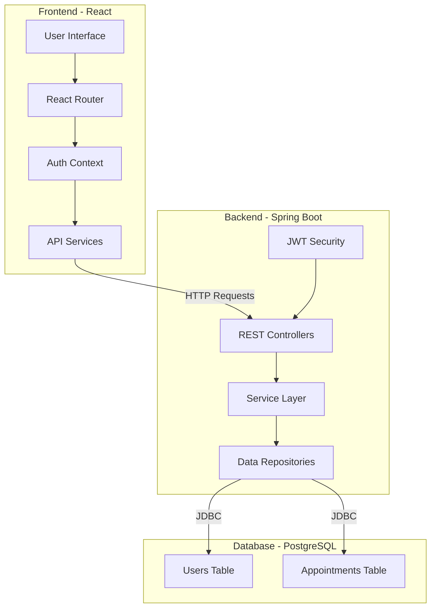
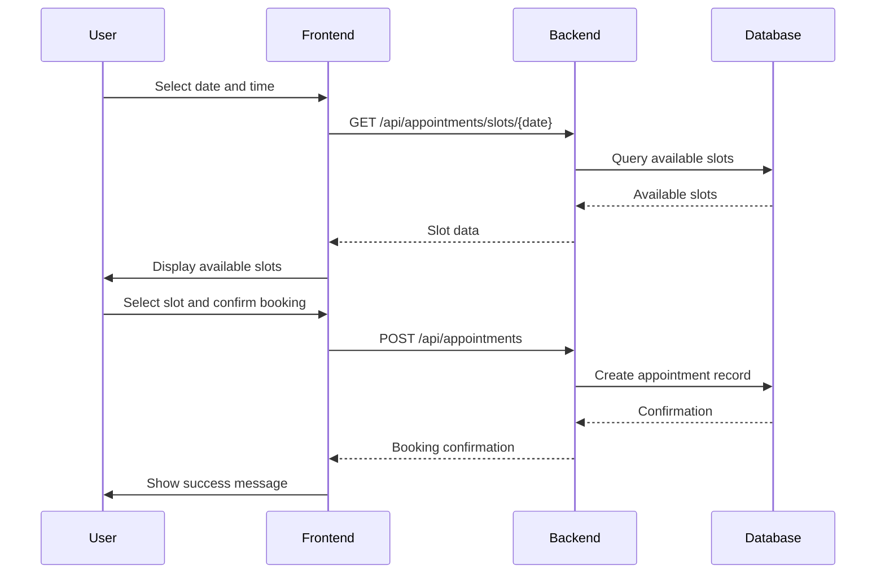

# Online Appointment Application - Architecture Plan

## Project Overview
A full-stack appointment booking application with Spring Boot backend and React frontend, featuring user authentication and admin management.

## Technology Stack

### Backend
- **Framework**: Spring Boot 3.x
- **Database**: PostgreSQL
- **ORM**: Spring Data JPA
- **Security**: Spring Security with JWT
- **Build**: Maven

### Frontend
- **Framework**: React 18+
- **State Management**: React Context/Hooks
- **HTTP Client**: Axios
- **Routing**: React Router v6
- **Styling**: CSS Modules / Styled Components

---

## Project Structure

```
TestKilo/
├── backend/                    # Spring Boot application
│   ├── src/main/java/com/appointment/
│   │   ├── config/            # Security & app configuration
│   │   ├── controller/        # REST API controllers
│   │   ├── dto/               # Data Transfer Objects
│   │   ├── entity/            # JPA entities
│   │   ├── repository/        # Data repositories
│   │   ├── security/          # JWT & security implementation
│   │   └── service/           # Business logic services
│   ├── src/main/resources/
│   │   ├── application.yml    # Spring configuration
│   │   └── schema.sql         # Database schema
│   └── pom.xml
├── frontend/                   # React application
│   ├── src/
│   │   ├── components/        # Reusable UI components
│   │   ├── pages/             # Page components
│   │   ├── context/           # React context providers
│   │   ├── services/          # API service layer
│   │   ├── hooks/             # Custom React hooks
│   │   ├── utils/             # Utility functions
│   │   └── styles/            # CSS styles
│   └── package.json
└── README.md
```

---

## Database Schema

### Users Table
```sql
CREATE TABLE users (
    id BIGSERIAL PRIMARY KEY,
    email VARCHAR(255) UNIQUE NOT NULL,
    password VARCHAR(255) NOT NULL,
    first_name VARCHAR(100) NOT NULL,
    last_name VARCHAR(100) NOT NULL,
    role VARCHAR(20) DEFAULT 'USER', -- USER or ADMIN
    created_at TIMESTAMP DEFAULT CURRENT_TIMESTAMP,
    updated_at TIMESTAMP DEFAULT CURRENT_TIMESTAMP
);
```

### Appointments Table
```sql
CREATE TABLE appointments (
    id BIGSERIAL PRIMARY KEY,
    user_id BIGINT REFERENCES users(id),
    title VARCHAR(255) NOT NULL,
    description TEXT,
    start_time TIMESTAMP NOT NULL,
    end_time TIMESTAMP NOT NULL,
    status VARCHAR(20) DEFAULT 'SCHEDULED', -- SCHEDULED, CANCELLED, COMPLETED
    created_at TIMESTAMP DEFAULT CURRENT_TIMESTAMP,
    updated_at TIMESTAMP DEFAULT CURRENT_TIMESTAMP
);
```

---

## API Endpoints

### Authentication
- `POST /api/auth/register` - Register new user
- `POST /api/auth/login` - Login and get JWT token
- `GET /api/auth/profile` - Get current user profile

### Appointments (User)
- `GET /api/appointments` - Get user's appointments
- `POST /api/appointments` - Create new appointment
- `GET /api/appointments/{id}` - Get specific appointment
- `PUT /api/appointments/{id}` - Update appointment
- `DELETE /api/appointments/{id}` - Cancel/delete appointment
- `GET /api/appointments/slots/{date}` - Get available slots for a date

### Appointments (Admin)
- `GET /api/admin/appointments` - Get all appointments
- `PUT /api/admin/appointments/{id}` - Update any appointment
- `DELETE /api/admin/appointments/{id}` - Delete any appointment
- `GET /api/admin/users` - Get all users

---

## Key Features

### User Features
- User registration and login
- View available appointment slots (24/7, 1-hour slots)
- Book, view, and manage appointments
- Cancel appointments

### Admin Features
- View all appointments
- Manage all appointments
- View all registered users
- Dashboard with appointment statistics

### Appointment Logic
- 1-hour appointment slots
- Available 24 hours a day, 7 days a week
- Slots automatically generated based on requested time
- Conflict detection - no double booking

---

## Security Implementation

### JWT Authentication Flow
1. User registers or logs in
2. Server validates credentials
3. Server generates JWT token
4. Client stores token (localStorage)
5. Client includes token in Authorization header
6. Server validates token on protected routes

### Password Security
- BCrypt password encoding
- Salt hashing for each password

---

## Frontend Pages

### Public Pages
- `/` - Home/Landing page
- `/login` - Login form
- `/register` - Registration form

### Protected User Pages
- `/dashboard` - User dashboard
- `/book` - Book new appointment
- `/my-appointments` - View user's appointments

### Protected Admin Pages
- `/admin` - Admin dashboard
- `/admin/appointments` - Manage all appointments
- `/admin/users` - Manage users

---

## Development Phases

### Phase 1: Backend Setup
- Create Spring Boot project structure
- Configure PostgreSQL connection
- Implement User and Appointment entities
- Set up JPA repositories
- Create service layer
- Implement REST controllers

### Phase 2: Authentication
- Implement Spring Security
- Add JWT token generation
- Create authentication endpoints
- Secure API endpoints

### Phase 3: Frontend Setup
- Initialize React project
- Set up routing
- Create API service layer
- Build authentication pages

### Phase 4: User Features
- Build dashboard
- Create appointment booking UI
- Implement slot selection
- Connect to backend APIs

### Phase 5: Admin Features
- Build admin dashboard
- Create appointment management views
- Add user management

### Phase 6: Testing & Polish
- Write unit tests
- Test end-to-end functionality
- Add styling and responsive design
- Finalize documentation

---

## Mermaid Diagram: System Architecture



---

## Mermaid Diagram: Appointment Booking Flow



---

## Next Steps

1. **Review and approve** this architecture plan
2. **Switch to Code mode** to start implementation
3. Begin with Phase 1: Backend Setup
